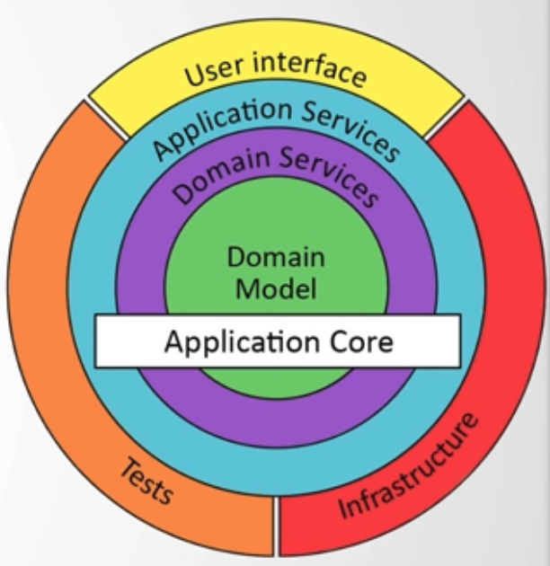
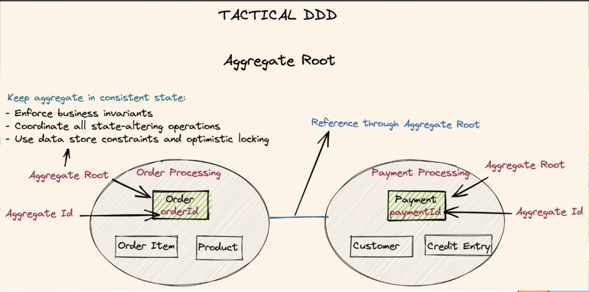
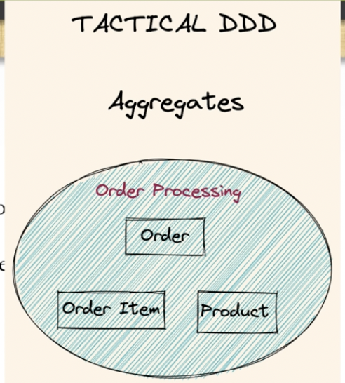
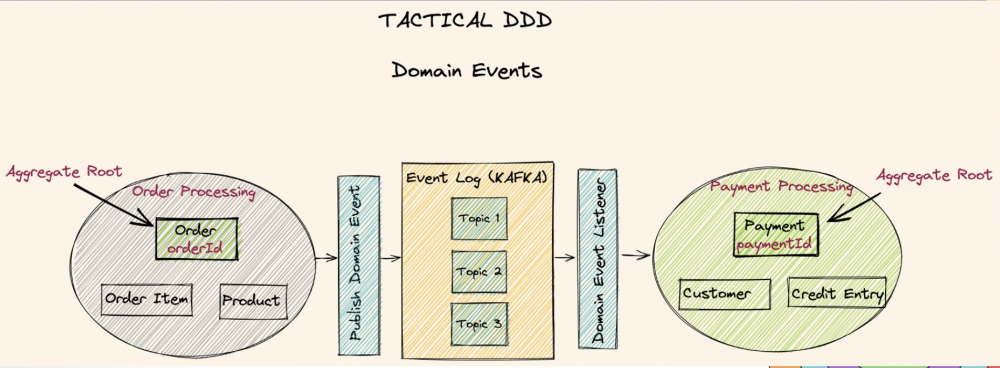
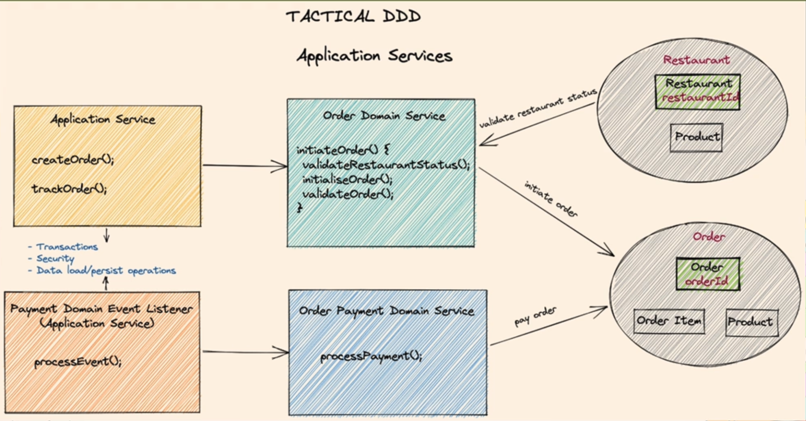

= Microservices & Event Sourcing, Clean Architecture, DDD, SAGA, Outbox & Kafka

== Links

- https://quarkus.io/[Quarkus IO]
- https://camel.apache.org/manual/rest-dsl.html[Apache Camel Rest DSL]
- https://camel.apache.org/camel-quarkus/2.15.x/user-guide/testing.html[Camel Quarkus Testing]
- https://camel.apache.org/camel-quarkus/2.15.x/reference/extensions/jta.html[Apache Camel Quarkus JTA]
- https://stackoverflow.com/questions/17435060/call-a-stored-function-on-postgres-from-java[Call a Stored Function Postgres on Java]
- https://jdbc.postgresql.org/documentation/callproc/[Calling Stored Functions and Procedures Postgres]
- https://camel.apache.org/manual/advice-with.html[Apache Camel AdviceWith]
- https://camel.apache.org/components/3.20.x/sql-component.html[Apache Camel SQL]
- https://camel.apache.org/components/3.20.x/sql-stored-component.html[Apache Camel SQL Stored Procedure Component]
- https://stackoverflow.com/questions/17117589/how-can-i-skip-tests-in-maven-install-goal-while-running-them-in-maven-test-goa/25908693#25908693[Maven Lifecycle Tests]
- https://delawen.com/2022/07/bungee-jumping-into-quarkus/[Bungee jumping into Quarkus: blindfolded but happy]

.Gemfile.lock
----
|- food-ordering-system     (pom)
|-|- shared                 (pom)
|-|-|- shared-domain        (jar)

|- food-ordering-system     (pom)
|-|- order-service          (pom)
|-|-|- application          (jar)
|-|-|- container            (jar)
|-|-|- dataaccess           (jar)
|-|-|- domain               (pom)
|-|-|-|- core               (jar)
|-|-|-|- service            (jar)
|-|-|-|- messaging          (jar)
----

.Skeletal Initial Structure
image::architecture/thumbs/images/skeletal-structure-all.png[]

== List Content

. Microservices - powered by Quarkus and Apache Camel
. Clean & Hexagonal Architecture
. Domain Driven Design (DDD): Bounded context, Entities, Aggregates, Value Objects, Domain services, Application services, and Domain Events
. Kafka: Event store for eds (Event driven Services), enable loosely coupled services that communicates through events

== Hexagonal Architecture

. Classified as Ports & Adapters
. Divides the software as insides and outsides, starting inside by domain layer
. The principle of Hexagonal is isolate the domain layer from any dependency such UI, Data layer infrastructure or any framework

.Hexagonal Principle

.Graphviz
[source,bash]
----
brew install graphviz
mvn com.github.ferstl:depgraph-maven-plugin:aggregate -DcreateImage=true -DreduceEdges=false -Dscope=compile "-Dincludes=com.food.ordering.system*.*"
----

.Maven Unit & Integration Tests
[source,bash]
----
# Just Unit Tests
mvn test
# Just IT Tests
mvn failsafe:integration-test
# All Unit and IT Tests
# mvn integration-test
----

.Install Maven Internal Dependencies libs
[source,bash]
----
mvn clean -DskipTests compile package
mvn install:install-file -Dfile=./target/shared-domain-1.0.jar \
  -DgroupId=com.food.ordering.system.shared.domain \
  -DartifactId=shared-domain -Dversion=1.0 -Dpackaging=jar \
  -DgeneratePom=true

mvn clean -DskipTests compile package
mvn install:install-file -Dfile=./target/core-1.0.jar \
  -DgroupId=com.food.ordering.system.order.service.domain.core \
  -DartifactId=core -Dversion=1.0 -Dpackaging=jar \
  -DgeneratePom=true

----

== DDD Introduction

. Domain Drive Design offers solutions to common problem when building enterprise
. We can classify DDD as Strategic or Tactical
.. Strategic DDD: Introduces boundaries for domain model, domain is an operational area of your application, e.g; Online food ordering
... Bounded Context: Central pattern in DDD, Boundary within a Domain
... Ubiquitous Language: Common Language used by domain Experts and devs to avoid technical terms

.Food Ordering Application classified (Domain)
image::architecture/thumbs/images/ddd-strategic.png[]

. Tactical DDD: Focuses on the implementation details of the domain logic such as:
.. Entities: Domain object with a Unique Identifier, embodies critical business rules
.. Aggregates: Group of Entities that needs a consistent state

.Tactical Strategic Exercise Applied p2
image::architecture/thumbs/images/concepts/tactica_ddd_entities.png[]

.Tactical DDD Aggregate Root Concepts

.Order Aggregates

.Order Service Clean Architecture
image::architecture/thumbs/images/concepts/order-service-clean-architecture.png[]

.Mapped Dependencies
image::architecture/thumbs/images/concepts/mapped_dependencies.png[]

... Aggregate Root (AR): Entrypoint Entity for an aggregate, all business operations should go through root, as rule an aggregate should be referenced from outside through its root only, AR must be pure, side-effect free

.Aggregate Root Classification

... Value Objects: Immutable Objects without identity

.Value Objects
image::architecture/thumbs/images/concepts/value-object.png[]

... Domain Events: describe things that happens and changes over the state of a domain

.Domain Events

... Domain Services: Business logic that cannot fit in the aggregate, is used when multiple aggregates required in business logic

... Applications Services: allows the isolated domain to communicate with outside, such - orchestrate transactions, security, looking up proper aggregates and saving state changes of the domain to the database, doesn't contain any business logic, they are triggered by domain events, they should not know about how to fire event

... #_Where to fire the Event?
In Application Service, domain layers shouldn't know about how to fire the event_#

.Application Services Rule

.Order Service Domain Logic
image::architecture/thumbs/images/concepts/tactical-ddd-pattern-applied.png[]

.draft Order Event
[source,json]
----
{

}
----