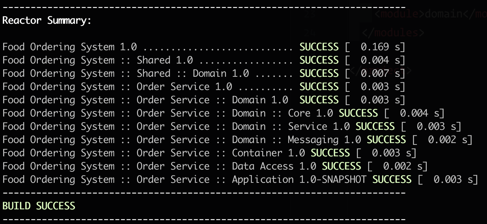
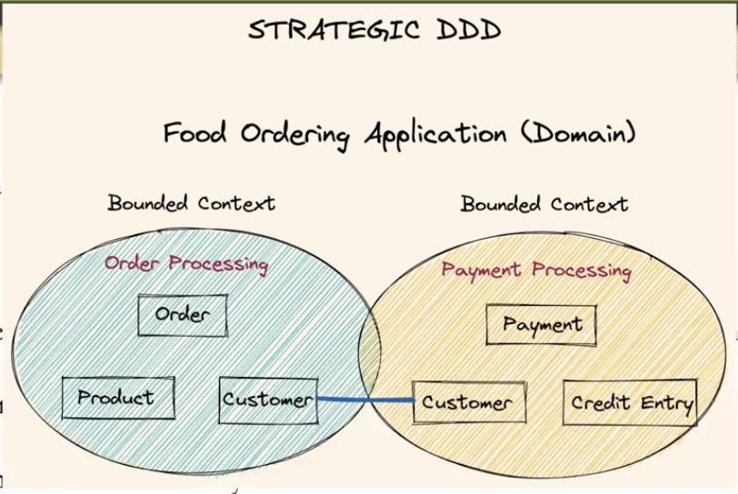
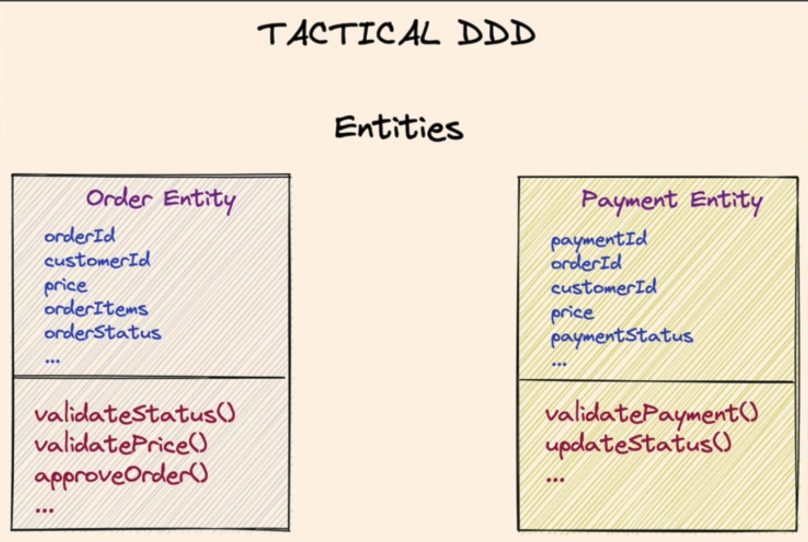
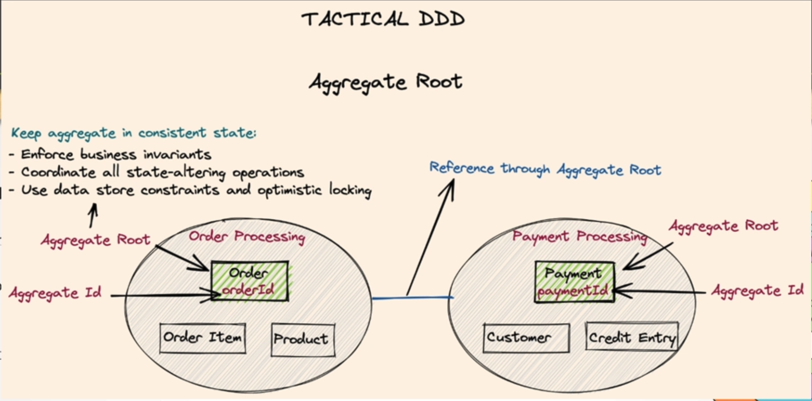
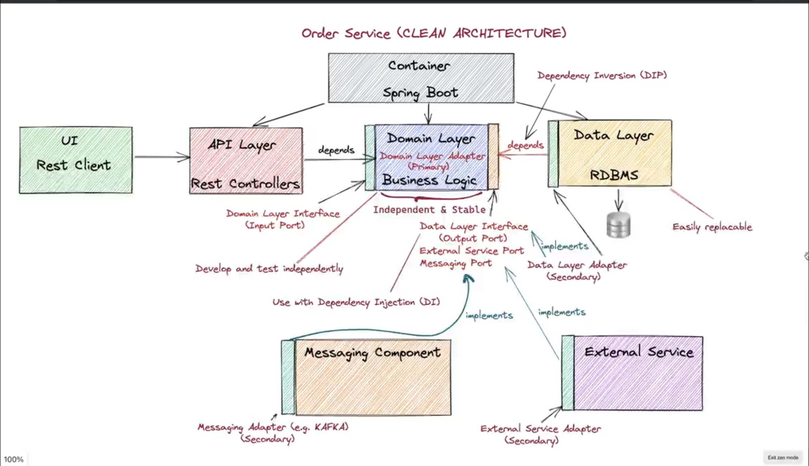
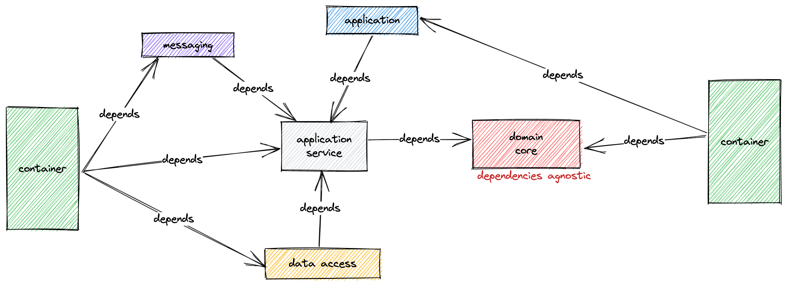
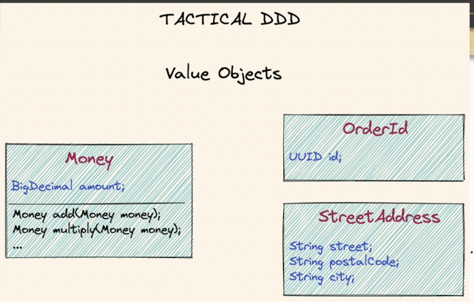

= Microservices: Clean Architecture, DDD, SAGA, Outbox & Kafka

== Links
- https://quarkus.io/[Quarkus IO]

.Gemfile.lock
----
|- food-ordering-system     (pom)
|-|- shared                 (pom)
|-|-|- domain               (jar)

|- food-ordering-system     (pom)
|-|- order-service          (pom)
|-|-|- application          (jar)
|-|-|- container            (jar)
|-|-|- dataaccess           (jar)
|-|-|- domain               (pom)
|-|-|-|- core               (jar)
|-|-|-|- service            (jar)
|-|-|-|- messaging          (jar)
----

.Skeletal Initial Structure

== List Content

. Microservices - powered by Quarkus and Apache Camel
. Clean & Hexagonal Architecture
. Domain Driven Design (DDD): Bounded context, Entities, Aggregates, Value Objects, Domain services, Application services, and Domain Events
. Kafka: Event store for eds (Event driven Services), enable loosely coupled services that communicates through events

== Hexagonal Architecture

. Classified as Ports & Adapters
. Divides the software as insides and outsides, starting inside by domain layer
. The principle of Hexagonal is isolate the domain layer from any dependency such UI, Data layer infrastructure or any framework

.Hexagonal Principle
image::thumbs/hexagonal_principle.png[]

.Graphviz
[source,bash]
----
brew install graphviz
mvn com.github.ferstl:depgraph-maven-plugin:aggregate -DcreateImage=true -DreduceEdges=false -Dscope=compile "-Dincludes=com.food.ordering.system*.*"
----

== DDD Introduction

. Domain Drive Design offers solutions to common problem when building enterprise
. We can classify DDD as Strategic or Tactical
.. Strategic DDD: Introduces boundaries for domain model, domain is an operational area of your application, e.g; Online food ordering
... Bounded Context: Central pattern in DDD, Boundary within a Domain
... Ubiquitous Language: Common Language used by domain Experts and devs to avoid technical terms

.Food Ordering Application classified (Domain)

. Tactical DDD: Focuses on the implementation details of the domain logic such as:
.. Entities: Domain object with a Unique Identifier, embodies critical business rules
.. Aggregates: Group of Entities that needs a consistent state

.Tactical Strategic Exercise Applied p2

.Tactical DDD Aggregate Root Concepts

.Order Aggregates
image::thumbs/order-aggragates-sample.png[]

.Order Service Clean Architecture

.Mapped Dependencies

... Aggregate Root (AR): Entrypoint Entity for an aggregate, all business operations should go through root, as rule an aggregate should be referenced from outside through its root only, AR must be pure, side-effect free

.Aggregate Root Classification
image::thumbs/order-aggragates-sample.png[]

... Value Objects: Immutable Objects without identity

.Value Objects

... Domain Events: describe things that happens and changes over the state of a domain

.Domain Events
image::thumbs/event-source-kafka.png[]

... Domain Services: Business logic that cannot fit in the aggregate, is used when multiple aggregates required in business logic

... Applications Services: allows the isolated domain to communicate with outside, such - orchestrate transactions, security, looking up proper aggregates and saving state changes of the domain to the database, doesn't contain any business logic, they are triggered by domain events, they should not know about how to fire event

.Application Services Rule
image::thumbs/application_services_nav.png[]

.Order Service Domain Logic
image::thumbs/tactical-ddd-pattern-applied.png[]

.draft Order Event
[source,json]
----
{

}
----